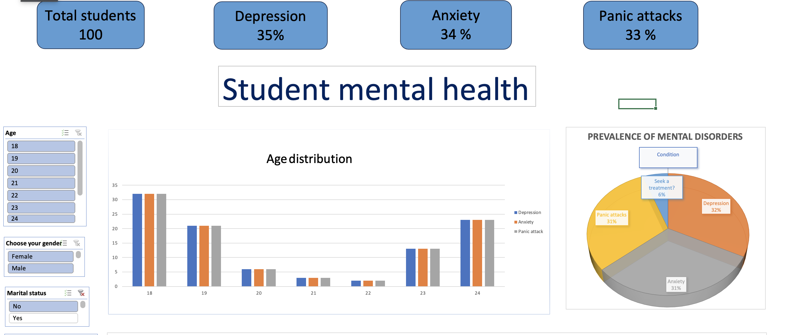

# Student Mental Health — Excel Dashboard Analysis

> Survey-based analysis of mental health prevalence and treatment-seeking behavior among 101 university students, built as an interactive Excel dashboard with pivot tables, charts, and slicers.

  

---

## Business Question

How prevalent are depression, anxiety, and panic attacks among university students — and what is the gap between students experiencing these conditions and those actually seeking professional help?

## Dataset

- **Source:** Public Kaggle dataset — *Student Mental Health* (Malaysian university survey, 2020)
- **Sample:** 101 students
- **Variables:** Gender, age, course of study, year of study, CGPA, marital status, three mental health indicators (depression / anxiety / panic attack), and whether the student sought specialist treatment

## Approach

Built end-to-end in Microsoft Excel:

1. **Data preparation** — cleaned and standardized raw survey responses (inconsistent year-of-study capitalization, trimmed whitespace in CGPA bands, handled missing age values).
2. **Pivot table layer** — built six pivot tables across separate sheets for each analytical view (Depression, CGPA × Years, Age × Gender, Course distribution, Mental disorders, plus the consolidated source).
3. **Visualization layer** — added pie chart (mental disorders distribution) and two bar charts (cross-cuts by gender and academic year) on a dedicated Dashboard sheet.
4. **Interactivity** — added Excel slicers connected to the pivot tables, allowing the reader to filter the dashboard by gender, year of study, and CGPA band.

## Key Insights

- **63% of students reported at least one mental health condition** (depression, anxiety, or panic attack), yet only **9.4% of them sought specialist treatment** — a striking 54-percentage-point treatment gap.
- **Female students reported depression at nearly twice the rate of male students** (39% vs 23%).
- **100% of married students reported depression**, compared to 22% of single students — a finding worth flagging for further investigation given the small married-student subgroup (n=16).
- Mental health conditions appeared across **all CGPA bands**, with no strong correlation between academic performance and reported symptoms — suggesting mental health is not a function of academic struggle alone.

## Tools & Techniques

- **Microsoft Excel** — pivot tables, pivot charts, slicers, conditional formatting, data cleaning formulas

## Files

- [`Student Mental health.xlsx`](Student%20Mental%20health.xlsx) — full workbook with raw data, six analytical sheets, and the interactive Dashboard sheet

## Screenshots

*Interactive Excel dashboard with pie chart (mental disorders distribution), 
two bar charts segmenting by gender and academic year, and slicers for 
filtering by gender, year of study, and CGPA.*

## Notes

This project was built as part of self-directed learning in data analytics. The dataset is publicly available on Kaggle and contains no personally identifiable information.
